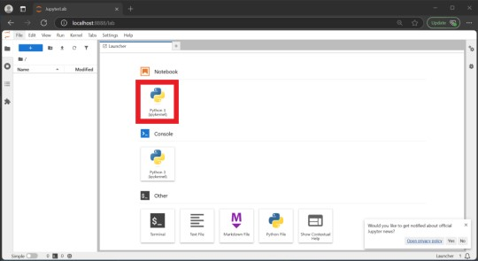
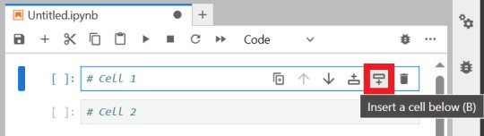

# [atet](https://github.com/atet) / [**_tts_**](https://github.com/atet/tts/blob/main/README.md#atet--tts)

[](#nolink)

Technically, we are starting with an audio clip and "cloning" the voice from that to generate new audio, speech-text-to-speech, speech-to-speech? *Whatever...*

**UPDATE**: I dove into all of this because of a funny [Game Jam 2025 idea](https://www.higherthanmars.com/) that ended up being a big part of the development, so check out our game that leveraged text-to-speech for some hilarious results!

----------------------------------------------------------------------------

## Table of Contents

* [0. Requirements](#0-requirements)
* [1. Docker](#1-docker)
* [2. Text-to-Speech Script](#2-text-to-speech-script)
* [3. Next Steps](#3-next-steps)

### Supplemental

* [Other Resources](#other-resources)
* [Troubleshooting](#troubleshooting)
* [References](#references)

----------------------------------------------------------------------------

## 0. Requirements

A bunch of requirements, but at least they're all free (except for that GPU if you don't already have one):

- Free Hugging Face account at: https://huggingface.co/join
  - Register your SSH public key with your Hugging Face account: https://huggingface.co/docs/hub/en/security-git-ssh#add-a-ssh-key-to-your-account
  - Test your SSH access and ensure your username is returned and not "`Hi anonymous...`" by executing: `$ ssh -T git@hf.co`
  - Some repositories require you to accept their terms and conditions on the Hugging Face website before you can download them through SSH
- High-speed internet, as you'll need to download almost 25 GB of data
- Short ~10-15 second audio clip with transcript (you'll have to do this manually as speech-to-text not covered here)
- Windows Subsystem for Linux (WSL) with Docker (and NVIDIA Container Toolkit if using NVIDIA GPU), more info here:
   - [Installing WSL and Docker](https://github.com/atet/wsl)
   - [Installing NVIDIA Container Toolkit](https://github.com/atet/llm?tab=readme-ov-file#2-installation)
- (Optional) An NVIDIA GPU with at least 20 GB of VRAM as CPU processing is ***much, much slower***:

   Mode | Execution Time (Mins.)
   --- | ---
   CPU+RAM | 🐌 10
   GPU+VRAM | 🚀 1

### Models From Hugging Face

- You must agree to `HKUSTAudio/Llasa-3B` repository terms on the Hugging Face website before you can clone it<a href="#references"><sup>1</sup></a>
- Three repositories being downloaded (~24 GB total):
   - [`HKUSTAudio/Llasa-3B` (~8 GB)](https://huggingface.co/HKUSTAudio/Llasa-3B)
   - [`HKUSTAudio/xcodec2` (~11 GB)](https://huggingface.co/HKUSTAudio/xcodec2)
   - [`facebook/w2v-bert-2.0` (~5 GB)](https://huggingface.co/facebook/w2v-bert-2.0)
- Download them to your WSL home directory, this may take a while ☕:

```bash
$ mkdir -p ~/models/HKUSTAudio && cd ~/models/HKUSTAudio && \
  git lfs clone git@hf.co:HKUSTAudio/Llasa-3B && \
  git lfs clone git@hf.co:HKUSTAudio/xcodec2 && \
  mkdir -p ~/models/facebook && cd ~/models/facebook && \
  git lfs clone git@hf.co:facebook/w2v-bert-2.0
```

### Input Audio

- Audio must be at 16 kHz sample rate, mono (not stereo), `*.wav` format
   - Free audio conversion with Audacity program: https://portableapps.com/apps/music_video/audacity_portable
- Audio used for input should be around 15 seconds and expected output to be maximum of about 15 seconds of speech:
   - Entire prompt + newly-generated audio can **only be about 35 seconds long** with this model
   - Longer prompt audio (15-20 seconds) allows for better voice mimicking but shorter generated audio (15-10 seconds)
   - Shorter prompt audio (~10 seconds) allows longer generated audio (~25 seconds) but worse voice mimicking
- Example audio files to use for input:
   - Machine-generated voice example from www.morgbob.com<a href="#references"><sup>2</sup></a>: [`./.dat/morgbob.wav`](https://github.com/atet/tts/blob/main/.dat/morgbob.wav)
   - Public domain (CC0) voice clip<a href="#references"><sup>3</sup></a>: [`./.dat/voice.wav`](https://github.com/atet/tts/blob/main/.dat/voice.wav)

[Back to Top](#table-of-contents)

----------------------------------------------------------------------------

## 1. Docker

We will make a custom Docker image that has CUDA, Pytorch, JupyterLab, and required Python dependencies to run the text-to-speech code. Docker images keep cleanup simple as nothing (other than Docker) is installed on your system.

### Creating Custom Image

- Pull `pytorch/pytorch:2.5.1-cuda12.4-cudnn9-devel` image and create a dockerfile:

```bash
$ docker pull pytorch/pytorch:2.5.1-cuda12.4-cudnn9-devel && \
  mkdir -p ~/docker && cd ~/docker && \
  nano dockerfile
```

- Copy and paste this dockerfile:

```dockerfile
FROM pytorch/pytorch:2.5.1-cuda12.4-cudnn9-devel
WORKDIR /root

RUN apt update
RUN apt -y upgrade
RUN apt -y install nano tmux htop rsync curl git
RUN pip install jupyterlab ipywidgets xcodec2==0.1.3

RUN touch /root/.jupyter/jupyter_lab_config.py
RUN echo "c = get_config() \n\
c.IdentityProvider.token = '' \n\
c.ServerApp.ip = '0.0.0.0' \n\
c.ServerApp.port = 8888 \n\
c.ServerApp.quit_button = False \n\
c.ServerApp.open_browser = False \n\
c.ServerApp.allow_root = True" >> /root/.jupyter/jupyter_lab_config.py

EXPOSE 8888
```

- Build the image, this may take a while ☕:

```bash
$ docker build -t tts_image .
```

- Create a Docker container and log into it:
   - `--gpus all` is a required flag for NVIDIA GPU processing
   - Must **change placeholder below to the absolute path** of your home directory in WSL

```bash
$ docker run -dit --gpus all -p 8888:8888 -v <ABSOLUTE_PATH_TO_HOME>:/root/shared --name tts tts_image && \
  docker exec -it tts /bin/bash
```

- Copy models into your Docker container (for much faster loading within container):

```bash
# mkdir -p /root/models/HKUSTAudio && cd /root/models/HKUSTAudio && \
  rsync --progress -r /root/shared/models/HKUSTAudio/Llasa-3B /root/models/HKUSTAudio/ && \
  rsync --progress -r /root/shared/models/HKUSTAudio/xcodec2 /root/models/HKUSTAudio/ && \
  mkdir -p /root/models/facebook && cd /root/models/facebook && \
  rsync --progress -r /root/shared/models/facebook/w2v-bert-2.0 /root/models/facebook/
```

- **IMPORTANT**: You must change the path for `facebook/w2v-bert-2.0` in the `xcodec2` Python library to point to your local repository for this model:

```bash
# cp /opt/conda/lib/python3.11/site-packages/xcodec2/modeling_xcodec2.py /opt/conda/lib/python3.11/site-packages/xcodec2/modeling_xcodec2.py.BAK && \
  sed -i 's/facebook\/w2v-bert-2.0/\/root\/shared\/models\/facebook\/w2v-bert-2.0/g' /opt/conda/lib/python3.11/site-packages/xcodec2/modeling_xcodec2.py
```

- Start JupyterLab server to create and run text-to-speech script:

```bash
# cd /root && \
  jupyter lab --port-retries=0 --ip 0.0.0.0 --allow-root --ServerApp.token=""
```

JupyterLab will now be accessible from your web browser at `localhost:8888`:



[Back to Top](#table-of-contents)

----------------------------------------------------------------------------

## 2. Text-to-Speech Script

JupyterLab will now be accessible from your web browser at `localhost:8888`. Use a Jupyter Notebook (outlined in red above) instead of running a Python script from command line, as the command line method must load and unload these large models files every script execution, taking unnecessary time between subsequent TTS runs.

Start a new Jupyter Notebook and ensure you **separate the code below<a href="#references"><sup>4</sup></a> into two cells** (click *Insert Cell* button outlined in red below), running cell 1 only once and using cell 2 to create audio clips:



### Cell 1

- **Run this cell only once per session!**
- Select GPU (line 9) or CPU (line 10) proessing

```python
# WARNING: Run this cell only once per session!
from transformers import AutoTokenizer, AutoModelForCausalLM
import torch
import soundfile as sf
from xcodec2.modeling_xcodec2 import XCodec2Model
import time

# Pick either GPU or CPU processing (comment out the other option)
MODE = "cuda"  # Using GPU+VRAM
# MODE = "cpu" # Using CPU+RAM

dir_llasa_3b = "/root/models/HKUSTAudio/Llasa-3B" # Path to local Llasa-3B repos
tokenizer = AutoTokenizer.from_pretrained(dir_llasa_3b)
model = AutoModelForCausalLM.from_pretrained(dir_llasa_3b)
model.eval() 
model.to(MODE)

# If you did not edit modeling_xcodec2.py with the local path of w2v-bert-2.0 in the above instructions, it will be downloaded from Hugging Face again
dir_xcodec2 = "/root/models/HKUSTAudio/xcodec2" # Path to local xcodec2 repos
Codec_model = XCodec2Model.from_pretrained(dir_xcodec2)
Codec_model.eval().to(MODE)

# Functions
def ids_to_speech_tokens(speech_ids):
    speech_tokens_str = []
    for speech_id in speech_ids:
        speech_tokens_str.append(f"<|s_{speech_id}|>")
    return speech_tokens_str

def extract_speech_ids(speech_tokens_str):
    speech_ids = []
    for token_str in speech_tokens_str:
        if token_str.startswith('<|s_') and token_str.endswith('|>'):
            num_str = token_str[4:-2]
            num = int(num_str)
            speech_ids.append(num)
        else:
            print(f"Unexpected token: {token_str}")
    return speech_ids

def tts():
    prompt_wav, sr = sf.read(filepath_prompt)
    prompt_wav = torch.from_numpy(prompt_wav).float().unsqueeze(0)
    input_text = prompt_text + target_text
    with torch.no_grad():
        start_time = time.time()
        print("Starting Text-to-Speech...")

        # Encode the prompt wav
        vq_code_prompt = Codec_model.encode_code(input_waveform=prompt_wav)
        #print("Prompt Vq Code Shape:", vq_code_prompt.shape)
        vq_code_prompt = vq_code_prompt[0,0,:]
        
        # Convert int 12345 to token <|s_12345|>
        speech_ids_prefix = ids_to_speech_tokens(vq_code_prompt)
        formatted_text = f"<|TEXT_UNDERSTANDING_START|>{input_text}<|TEXT_UNDERSTANDING_END|>"
    
        # Tokenize the text and the speech prefix
        chat = [
            {"role": "user", "content": "Convert the text to speech:" + formatted_text},
            {"role": "assistant", "content": "<|SPEECH_GENERATION_START|>" + ''.join(speech_ids_prefix)}
        ]
        input_ids = tokenizer.apply_chat_template(
            chat,
            tokenize               = True,
            return_tensors         = "pt",
            continue_final_message = True
        )
        input_ids = input_ids.to(MODE)
        speech_end_id = tokenizer.convert_tokens_to_ids('<|SPEECH_GENERATION_END|>')
    
        # Generate the speech autoregressively
        outputs = model.generate(
            input_ids,
            max_length   = 2048,  # This model is trained with a max length of 2048, do not use a different number
            eos_token_id = speech_end_id,
            do_sample    = True,
            top_p        = 1,
            temperature  = 0.8,
        )

        # Extract the speech tokens
        generated_ids = outputs[0][input_ids.shape[1]-len(speech_ids_prefix):-1]
        speech_tokens = tokenizer.batch_decode(generated_ids, skip_special_tokens=True)
    
        # Convert  token <|s_23456|> to int 23456
        speech_tokens = extract_speech_ids(speech_tokens)
        speech_tokens = torch.tensor(speech_tokens).to(MODE).unsqueeze(0).unsqueeze(0)
    
        # Decode the speech tokens to speech waveform
        gen_wav_full = Codec_model.decode_code(speech_tokens)
        gen_wav_new = gen_wav_full[:,:,prompt_wav.shape[1]:]
        
        end_time = time.time()
        elapsed_time = end_time - start_time
        
        print("DONE! Elapsed time:", int(round(elapsed_time, 0)), "seconds.")
        sf.write(filepath_save_full, gen_wav_full[0, 0, :].cpu().numpy(), 16000)
        print("- Full audio file written to:", filepath_save_full)
        sf.write(filepath_save_new, gen_wav_new[0, 0, :].cpu().numpy(), 16000)
        print("- Newly-generated audio file written to:", filepath_save_new)
```

### Cell 2

- This code will generate new speech from your example voice clip, change placeholder below to your path of `morgbob.wav`; output will be saved to your WSL home directory
- You change parameters here like input filepaths, save filepaths, and transcripts, then you can re-run this cell multiple times without having to waste time reloading models from cell 1

```python
# Prompt audio file, must be 16 kHz, mono, *.wav format
filepath_prompt    = "<PATH_TO_morgbob.wav>"
# Appends newly-generated audio to prompt audio, allowing you to hear the original prompt audio transition to the newly-generated audio
filepath_save_full = "/root/shared/morgbob_generated_full.wav"
# Only the newly-generated audio
filepath_save_new  = "/root/shared/morgbob_generated_new.wav"

# You must provide the transcript of the prompt audio clip
prompt_text = "I am Morgbob. I am no stranger to a strange creature."
# This is the newly-generated, never-before-heard speech you want generated by the model
target_text = "I don't know who you are, I don't know what you want, if you are looking for ransom, I can tell you I don't have money. But what I do have are a very particular set of skills. Skills I have acquired over a very long career, skills that make me a nightmare for people like you."

# Run TTS function
tts()
```

### Results

So easy! Check out the results below (NOTE: Browser audio player on mute by default):

- Input ([`./.dat/morgbob.wav`](https://github.com/atet/tts/blob/main/.dat/morgbob.wav))

https://github.com/user-attachments/assets/b43a2c7c-df9c-4b7f-823b-997af61a5bae

- Input + newly-generated audio ([`./.dat/morgbob_generated_full.wav`](https://github.com/atet/tts/blob/main/.dat/morgbob_generated_full.wav))

https://github.com/user-attachments/assets/b0a7e400-604c-4ec3-9c4e-75421d5cb7eb

- Newly-generated audio only ([`./.dat/morgbob_generated_new.wav`](https://github.com/atet/tts/blob/main/.dat/morgbob_generated_new.wav))

https://github.com/user-attachments/assets/15635793-1e51-4df6-bdeb-f06cd8ff7aae

[Back to Top](#table-of-contents)

----------------------------------------------------------------------------

## 3. Next Steps

Congratulations for getting through this tutorial, hopefully you're more confident about deploying advanced artificial intelligence models on your own now.

Sky is the limit for next steps:
- Create a Python Streamlit application to give this process a nice graphical user interface
- Experiment with other modalities like [text generation (e.g., ChatGPT-like chatbot)](https://huggingface.co/models?pipeline_tag=text-generation&sort=trending), [text-to-image](https://huggingface.co/models?pipeline_tag=text-to-image&sort=trending), [image-to-text](https://huggingface.co/models?pipeline_tag=image-to-text&sort=trending), [image-text-to-text](https://huggingface.co/models?pipeline_tag=image-text-to-text&sort=trending)...

[Back to Top](#table-of-contents)

----------------------------------------------------------------------------

## Other Resources

**Description** | **URL Link**
--- | ---
Hugging Face | https://huggingface.co

[Back to Top](#table-of-contents)

----------------------------------------------------------------------------

## Troubleshooting

Issue | Solution
--- | ---
**"The audio output is really weird!"** | `¯\_(ツ)_/¯` Sometimes it be like that, just try processing it again (it should use a different [seed](https://csrc.nist.gov/glossary/term/seed#:~:text=The%20input%20to%20a%20pseudorandom%20number%20generator.%20Different%20seeds%20generate%20different%20pseudorandom%20sequences.) next time)
**"It's not working!"** | This concise tutorial has distilled hours of sweat, tears, and troubleshooting; _it can't not work_

[Back to Top](#table-of-contents)

----------------------------------------------------------------------------

## References

1. Llasa 3B is licensed under [Creative Commons Attribution Non Commercial No Derivatives 4.0](https://creativecommons.org/licenses/by-nc-nd/4.0/deed.en):
   - **Attribution** — You must give appropriate credit, provide a link to the license, and indicate if changes were made. You may do so in any reasonable manner, but not in any way that suggests the licensor endorses you or your use.
   - **Non Commercial** — You may not use the material for commercial purposes.
   - **No Derivatives** — If you remix, transform, or build upon the material, you may not distribute the modified material.
2. Generated speech from [www.morgbob.com](https://www.morgbob.com) made with [Microsoft text-to-speech and can be used for commercial purposes](https://learn.microsoft.com/en-us/answers/questions/1192398/can-i-use-azure-text-to-speech-for-commercial-usag#:~:text=%40Newstart%20Yes%2C%20you%20can%20use,mentioned%20in%20the%20pricing%20page.)
3. [Public domain (CC0)](https://www.tldrlegal.com/license/creative-commons-cc0-1-0-universal) voice clip from [eugeneloza](https://opengameart.org/content/airport-announcement-voice-acting-stk)
   - **No Rights Reserved** — CC0 is a "no rights reserved" option that allows creators to give up their copyright and related rights.
   - **Public domain** — CC0 places the work in the public domain, so others can use it without restriction.
   - **Irrevocable** — CC0 is irrevocable, meaning once it's applied, it can't be changed.
4. Text-to-speech code adapted from [`HKUSTAudio/Llasa-3B` "Speech synthesis utilizing a given speech prompt" script](https://huggingface.co/HKUSTAudio/Llasa-3B#how-to-use)

[Back to Top](#table-of-contents)

----------------------------------------------------------------------------

<p align="center">Copyright © 2025-∞ Athit Kao, <a href="http://www.athitkao.com/tos.html" target="_blank">Terms and Conditions</a></p>
